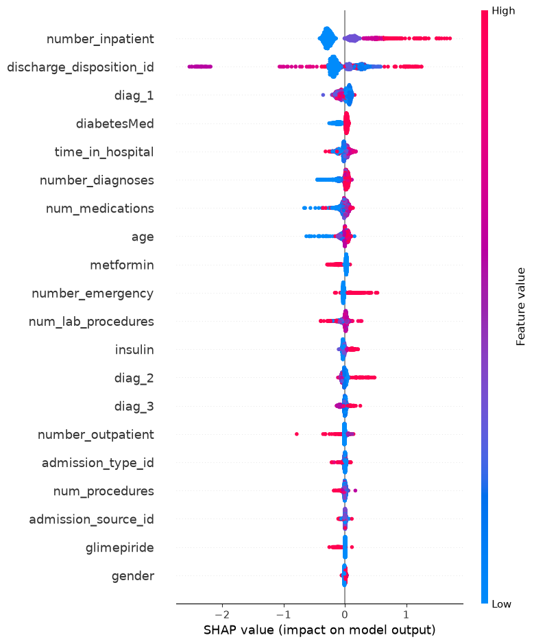
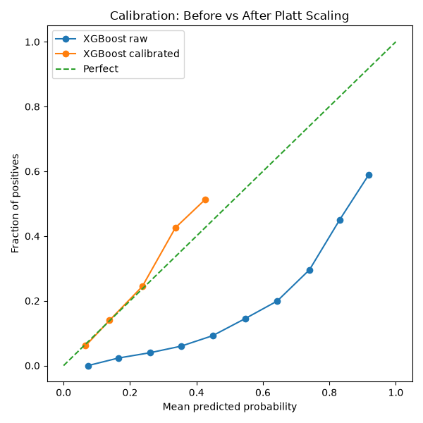

# 🏥 30-Day Hospital Readmission Risk Predictor

A machine learning system that predicts the probability of a diabetic patient being readmitted to hospital within 30 days of discharge, with per-patient explainability via SHAP.

**Live Demo:** [hospital-readmission-risk.streamlit.app](https://hospital-readmission-risk.streamlit.app)

---

## Problem Statement

Hospital readmissions within 30 days are costly, often preventable, and a key quality indicator in healthcare. This project builds a calibrated risk scorer that gives clinicians an interpretable probability — not just a binary flag — so they can prioritise high-risk patients at discharge.

---

## Dataset

- **Source:** UCI Diabetes 130-US Hospitals dataset (Kaggle)
- **Size:** 101,766 patient records, 50 features
- **Target:** Binary — readmitted within 30 days (`<30`) vs not
- **Class balance:** 11.2% positive (readmitted), 88.8% negative

---

## Pipeline

Raw EHR data

↓

Feature Engineering

↓

XGBoost Classifier (scale_pos_weight=7.96)

↓

Platt Scaling Calibration

↓

SHAP Explainability

↓

Streamlit Dashboard

---

## Features Used

| Category | Features |
|---|---|
| Patient history | Prior inpatient, emergency, outpatient visits |
| Admission | Type, source, discharge disposition |
| Clinical | Length of stay, number of diagnoses, procedures, medications |
| Diagnosis | ICD-10 grouped into 8 disease categories |
| Medication | Metformin, insulin, 20+ other diabetes medications |
| Demographics | Age (converted from brackets to midpoints), gender, race |

---

## Results

| Metric | Value |
|---|---|
| AUROC | 0.6876 |
| Brier Score (before calibration) | 0.218 |
| Brier Score (after Platt scaling) | 0.094 |
| Top predictors | Prior inpatient visits, discharge disposition |

> Calibration halved the Brier score, meaning the model's predicted probabilities are substantially more reliable as actual probability estimates.

---

## Explainability

SHAP (SHapley Additive exPlanations) is used at two levels:

- **Global:** Feature importance across all patients
- **Per-patient:** Waterfall plot showing exactly which factors pushed a specific patient's risk up or down




---

## Project Structure

hospital-readmission/

│

├── data/                          # Raw and processed data (not pushed)

├── models/                        # Trained models and plots

│   ├── xgb_model.pkl

│   ├── xgb_calibrated.pkl

│   ├── shap_summary.png

│   └── calibration_comparison.png

│

├── notebooks/

│   ├── eda.py                     # Exploratory data analysis

│   ├── feature_engineering.py     # Feature pipeline

│   ├── modelling.py               # XGBoost training

│   ├── calibration.py             # Platt scaling

│   └── explainability.py          # SHAP analysis

│

├── app.py                         # Streamlit dashboard

├── requirements.txt

└── README.md

---

## Setup

```bash
git clone https://github.com/mikebros2906/hospital-readmission.git
cd hospital-readmission
python -m venv venv
venv\Scripts\activate
pip install -r requirements.txt
streamlit run app.py
```

> Note: Download the dataset from [Kaggle](https://www.kaggle.com/datasets/brandao/diabetes) and place `diabetic_data.csv` in the `data/` folder before running the pipeline scripts.

---

## Tech Stack

- **Python** — pandas, numpy, scikit-learn
- **Model** — XGBoost with calibrated probabilities
- **Explainability** — SHAP
- **Deployment** — Streamlit Cloud

---

## Author

**Somik Chowdhury**
MSc Big Data Management and Analytics — Griffith College Dublin
[LinkedIn](https://linkedin.com/in/somikchowdhury) | [GitHub](https://github.com/mikebros2906)